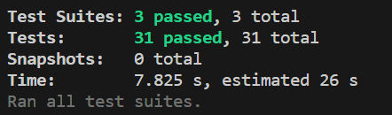

# Lab 8 - Starter

Jennifer Tanurdjaja
## Intro

1. I would fit my automated tests within a Github action that runs whenever code is pushed. The Github actions can be used to prevent people from pushing broken code because it can be set so that people cannot merge code unless they pass the tests run by Github actions.
2. No, because E2E testing is used to automate test cases that involve emulating user actions. I would use unit testing to check if a function returns the correct output because we are simply checking if the function will return a particular output. We are not emulating any user action in this case.
3. No, I do not think that this is the right use of unit testing because we are testing how individual components are interacting with each other. In this case, we are testing the message feature, which encapsulates components on sender and receiver ends.
4. Yes, I think that this is a feasible use of unit testing because we are only testing an individual part of the code. We can simply test inputs that are greater than 80 characters to see if the function will return false. We can also test if the general expected inputs are possible.

